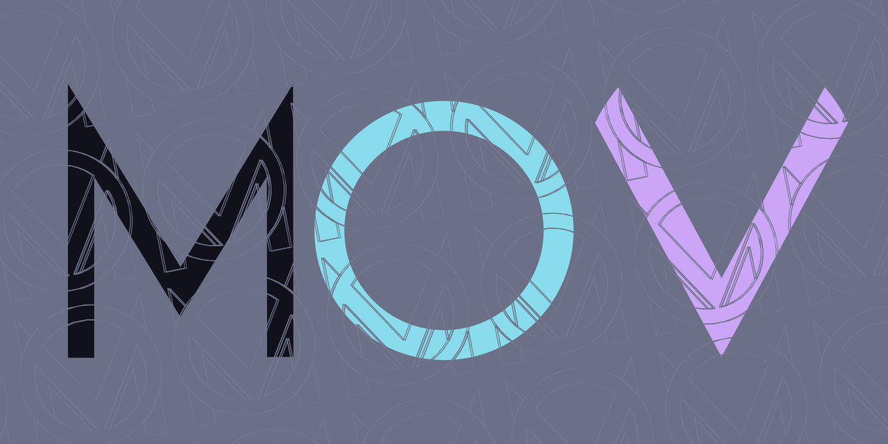

# CatNowBot - codename "Mov"

 
An open source self-hostable Discord bot written in Eris framework. Most likely
a replacement for [Jolly](https://github.com/raluvy95/jolly)

This project is currently in progress, expect to have bugs and frequently
changes to commands/database or other!

# Setting up

1. Just simply run `npm i .` 
2. Rename `.env.example` to `.env` and complete there 
3. Run with `npm run start`

# Workarounds

## Migration from Jolly

If you have used Jolly or Jolly-based custom bot, you can migrate level system
to Mov.  We only support database migration for leveling. After running the
bot for first time, kill it and run `npm run migrate` **with your
database.sqlite** inside the root project. It's recommend to keep
database.sqlite at this moment.

## Catppify

This is a tool to generate image using Catppuccin palette. You need to intergate `palettes` and `catppify` files from [my repo](https://github.com/raluvy95/catppify) to `./bin` directory 
Set `CATPPIFY=0` in your .env file if you don't want.

# Contributing

Feel free to contribute whatever you want, as long as our build passed. (using
tsc --noEmit for checking and Rome for styling)
 
 
  
