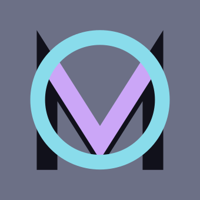

# CatNowBot - codename "Mov"

An open source self-hostable Discord bot written in Eris framework. Most likely
a replacement for [Jolly](https://github.com/raluvy95/jolly)

This project is currently in progress, expect to have bugs and frequently
changes to commands/database or other!

# Setting up

1. Just simply run `npm i .` 
2. Rename `.env.example` to `.env` and complete there 
3. Run with `npm run start`

# Workarounds

## Migration from Jolly

If you have used Jolly or Jolly-based custom bot, you can migrate level system
to Mov.  We only support database migration for leveling. After running the
bot for first time, kill it and run `npm run migrate` **with your
database.sqlite** inside the root project. It's recommend to keep
database.sqlite at this moment.

## Qalculate

Download the zip file from
[their release](https://github.com/Qalculate/libqalculate/releases), extract
only `qalc` binary and then place inside `bin` directory. Not tested on
Windows/Mac OS, but please pull request if you have tested on other platform!

# Lavalink

This bot now supports lavalink for music purpose If you have lavalink up
running, you can set the variables in the .env file

(not finished yet)
