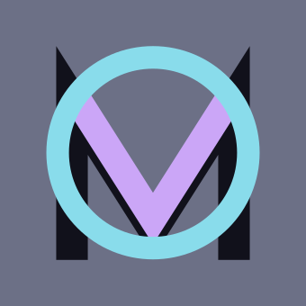
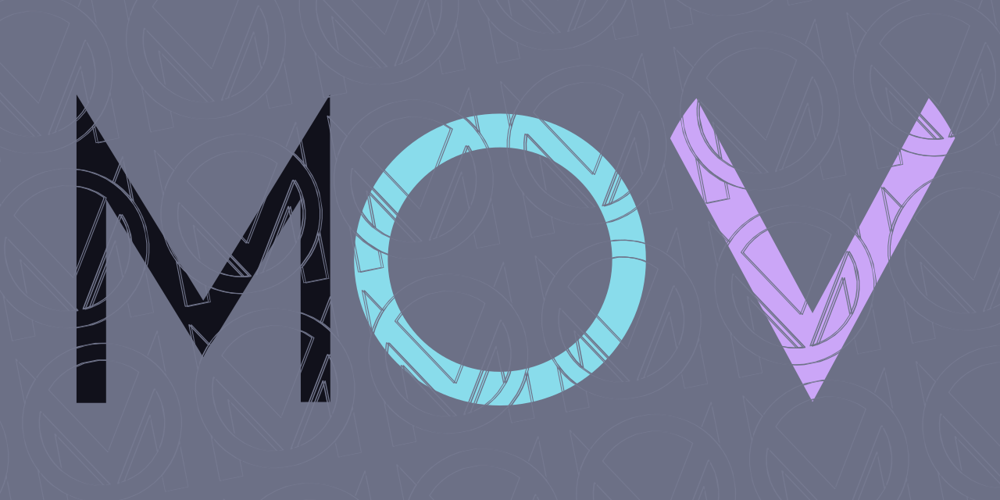

# CatNowBot - codename "Mov"

 
An open source self-hostable Discord bot written in Eris framework. Most likely
a replacement for [Jolly](https://github.com/raluvy95/jolly)

This project is currently in progress, expect to have bugs and frequently
changes to commands/database or other!

# Setting up

Requires `bun`

1. Just simply run `bun i .` 
2. Rename `.env.example` to `.env` and complete there 
3. Run with `bun start`

# Contributing

Feel free to contribute whatever you want, as long as our build passed. (using
tsc --noEmit for checking and Rome for styling)
 
 
  
